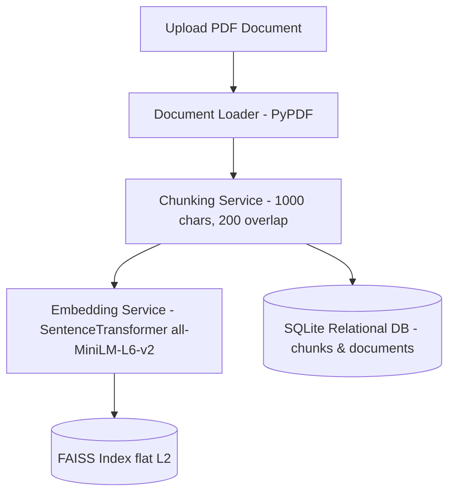
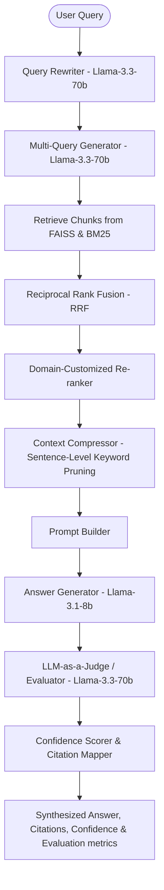

# ⚡ Enterprise-Grade Production RAG Platform

A high-performance, modular Retrieval-Augmented Generation (RAG) platform designed for compliance analysis, policy auditing, and regulatory document intelligence. Featuring query rewriting, multi-query expansion, hybrid retrieval (FAISS + BM25), domain-customized re-ranking, context compression, automated evaluation, and real-time execution observability.

---

## 🚀 Key Platform Capabilities

*   **Advanced Query Processing**: Integrated query re-writing and multi-query expansion via `llama-3.3-70b-versatile` to capture semantic intent and maximize retrieval recall.
*   **Hybrid Retrieval Engine**: Combines dense vector search (`FAISS` using `SentenceTransformers all-MiniLM-L6-v2`) with sparse lexical search (`BM25Okapi`) orchestrated through **Reciprocal Rank Fusion (RRF)**.
*   **Domain-Customized Re-ranking**: Lexical-semantic reranker customized for Indian securities regulations (SEBI, ESOPs, sweat equity, retirement benefits) to elevate precise regulatory context.
*   **Sentence-Level Context Compression**: Reduces LLM token noise, prompt bloat, and cost by pruning non-relevant sentences from retrieved chunks, preserving only query-aligned segments.
*   **Automated Evaluation & LLM Guardrails**: "LLM-as-a-Judge" pipeline verifying **Faithfulness**, **Answer Relevancy**, and **Hallucination Detection** with a local heuristic fallback if API rate limits are hit.
*   **Executive Dashboard & Benchmarking Suite**: Streamlit analytics interface supporting query execution, PDF ingestion, historical evaluation observability, and live retrieval engine benchmarking (Precision@K, Recall@K, MRR, Latency).

---

## 🏛️ System Architecture

### 1. Document Ingestion Flow
This flow governs how documents are ingested, parsed, embedded, and indexed into relational metadata storage and vector databases.



### 2. End-to-End Query Inference Pipeline
This diagram displays the lifecycle of a query from the initial user input to query expansion, multi-stage retrieval, reranking, generation, and LLM-as-a-Judge evaluation.



---

## 📂 Project Structure

The project adheres to a clean, modular structure separating concern across data models, databases, ingestion logic, retrieval algorithms, generation flows, observability, and evaluation metrics:

```directory
Production-RAG-Plateform/
│
├── data/                       # Local data stores (Git ignored)
│   ├── documents/              # Source PDFs to ingest
│   ├── faiss_index/            # Serialized FAISS indices (rag.index)
│   ├── uploads/                # Dynamic PDF uploads via Streamlit
│   └── rag.db                  # SQLite database for documents, chunks & evaluations
│
├── src/
│   ├── config/
│   │   └── settings.py         # Centralized configuration variables
│   │
│   ├── dashboard/
│   │   └── streamlit_app.py    # Streamlit Executive Dashboard
│   │
│   ├── data_models/            # Structured type hints & schema definitions
│   │   ├── chunk.py
│   │   ├── document.py
│   │   ├── evaluation_result.py
│   │   └── retrieval_result.py
│   │
│   ├── database/
│   │   └── sqlite_manager.py   # SQLite CRUD Operations & Schema Creation
│   │
│   ├── evaluation/             # RAG Quality & Performance Evaluation
│   │   ├── benchmarking.py     # Retrieval benchmark (Precision, Recall, MRR, Latency)
│   │   ├── llm_judge.py        # LLM-as-a-Judge evaluation (faithfulness, relevancy)
│   │   └── ragas_evaluator.py  # Evaluator interface with heuristic fallbacks
│   │
│   ├── generation/             # Text generation pipeline
│   │   ├── answer_generator.py # ChatGroq wrapper for llama-3.1-8b
│   │   ├── citation_service.py # Page-level citations builder
│   │   ├── confidence_service.py # Grounding & coverage confidence scorer
│   │   └── prompt_builder.py   # System prompts construction
│   │
│   ├── ingestion/              # Ingestion ETL Pipeline
│   │   ├── chunking_service.py # Character-based overlapping text chunker
│   │   ├── document_ingestion_pipeline.py # Orchestrates Loader -> Chunker -> Embeddings
│   │   ├── document_loader.py  # PyPDF text extraction
│   │   └── embedding_service.py# sentence-transformers all-MiniLM-L6-v2 embeddings
│   │
│   ├── observability/
│   │   └── metrics_logger.py   # Step-by-step latency & execution metric timers
│   │
│   ├── pipeline/
│   │   └── rag_pipeline.py     # Main end-to-end RAG orchestrator
│   │
│   ├── retrieval/              # Multi-strategy search engines
│   │   ├── bm25_retriever.py   # BM25 lexical retriever
│   │   ├── category_router.py  # Router for category-based searches
│   │   ├── chunk_mapper.py     # Mapping vector index slots to document references
│   │   ├── context_compressor.py # Context pruner for reducing token noise
│   │   ├── hybrid_retriever.py # RRF fusion retriever
│   │   ├── multi_query_retriever.py # Retrieval matching expanded query lists
│   │   ├── reranker.py         # Custom keyword & compliance term reranker
│   │   ├── retriever.py        # Unified retrieve manager
│   │   └── vector_retriever.py # Dense FAISS Vector retriever
│   │
│   └── utils/
│       └── helpers.py          # Utility script helper methods
│
├── .env                        # Local API configuration credentials (Groq & Google)
├── main.py                     # CLI wrapper interface for RAG pipeline execution
├── pyproject.toml              # Project dependencies & Python metadata
├── requirements.txt            # System dependencies package list
├── upload_document.py          # Script to ingest data/documents/ into SQLite & FAISS
└── uv.lock                     # Lockfile for project dependencies
```

---

## 🛠️ Detailed Component Breakdown

### 1. Hybrid Retrieval & RRF Fusion
Rather than relying solely on semantic vector search (which can miss specific IDs or acronyms) or lexical BM25 search (which misses synonyms and conceptual intent), the platform retrieves candidate document chunks from both systems.
It fusions these candidate indexes using **Reciprocal Rank Fusion (RRF)**:

$$\text{RRF Score}(d) = \sum_{m \in M} \frac{1}{k + r_m(d)}$$

Where $M$ represents the search models (Vector & BM25), $r_m(d)$ is the rank of document $d$ under model $m$, and $k$ is a constant (set to $60$). This generates a robust, deduplicated, and unified rank list.

### 2. Domain-Customized Reranker
Designed specifically for auditing compliance documents, the reranker sorts the fusions according to term overlap with the query, adding heavy weight modifications ($+3$ score boost) to matches containing regulatory concepts such as:
*   *Employee Stock Option Scheme (ESOS)*
*   *Employee Stock Purchase Scheme (ESPS)*
*   *Stock Appreciation Rights (SAR)*
*   *Sweat Equity / Retirement Benefits*

### 3. Context Compression
To optimize generation quality and reduce API token consumption, retrieved text chunks are split into sentences. The system filters out non-relevant sentences, compiling a compressed context string using only sentences that match query keywords.

### 4. LLM-as-a-Judge & Observability
Every execution step is timed using Python context managers in the `MetricsLogger` class.
The generated response is automatically assessed using `llama-3.3-70b-versatile` across:
1.  **Faithfulness**: Is the answer fully grounded in the context?
2.  **Answer Relevancy**: Does it resolve the user's specific question?
3.  **Judge Score**: Evaluation rating (0-100).
4.  **Hallucination Check**: Categorical flag ($0$ or $1$) highlighting context-unsupported details.

Evaluation runs are persisted inside `rag.db`'s `evaluations` table for analytics tracking.

---

## 🏁 Getting Started

### 📋 Prerequisites
*   Python **3.12+**
*   **Groq API Key**: Essential for generation (`llama-3.1-8b-instant`) and evaluation/rewriting (`llama-3.3-70b-versatile`).

### 📦 Setup & Installation

1.  **Clone the Repository**:
    ```bash
    git clone https://github.com/PatelDhruv113/Production-RAG-Plateform.git
    cd Production-RAG-Plateform
    ```

2.  **Set Environment Variables**:
    Create a `.env` file in the root folder:
    ```env
    GROQ_API_KEY="your-groq-api-key-here"
    ```

3.  **Install Dependencies**:
    Using the modern Python packaging tool `uv` (recommended):
    ```bash
    uv venv
    .venv\Scripts\activate   # Windows
    # source .venv/bin/activate # macOS/Linux
    uv pip install -r requirements.txt
    ```
    *Alternatively, using standard pip:*
    ```bash
    pip install -r requirements.txt
    ```

### 📥 Document Ingestion
Place your regulatory or policy PDFs in the `data/documents/` folder, then run the ingestion script to parse text, chunk content, generate sentence embeddings, and build the databases:
```bash
python upload_document.py
```

### 🖥️ Running the Streamlit Dashboard
Launch the executive dashboard to access the interactive web client:
```bash
streamlit run src/dashboard/streamlit_app.py
```
This launches a browser-based UI containing:
1.  **Query RAG**: Main search screen displaying synthesized responses, citation pages, execution latency breakdown (ms), confidence scores, and LLM Judge evaluations.
2.  **Document Management**: Dynamic PDF uploader that runs ingestion on-the-fly.
3.  **Evaluation Dashboard**: Metrics analytics showing average faithfulness, relevancy, and response latency graphs.
4.  **Retrieval Benchmarking**: Comparative benchmark runner plotting Precision@K, Recall@K, and MRR.

### 💻 Running the CLI
To interact with the pipeline directly inside the shell:
```bash
python main.py
```

---

## 📊 Retrieval Benchmarking Metrics

The benchmark suite evaluates retrieval performance metrics by searching across indexed databases using derived queries, measuring against document keywords:
*   **Precision@K**: The percentage of retrieved chunks that contain target concepts.
*   **Recall@K**: The percentage of target concepts successfully retrieved in the top K chunks.
*   **MRR (Mean Reciprocal Rank)**: The reciprocal rank of the first relevant retrieved chunk.
*   **Avg Latency (ms)**: The database retrieval time.

Comparative benchmarking charts can be generated dynamically within the **Retrieval Benchmarking** tab of the Streamlit dashboard.
